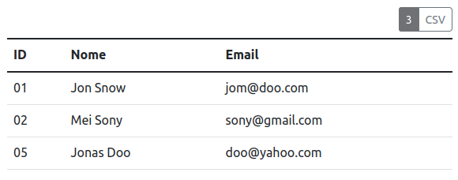
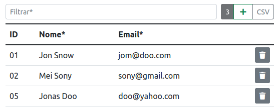
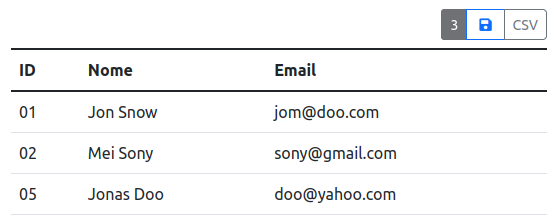

# jsTable

Library em javascript ( vanilla ) para operações com tabelas preexistentes ou criadas dinamicamente.

&nbsp;
> **Version:** 2.1 
> **Release:** 07/08/2022 
> **Author:** Rafael Gustavo Alves

&nbsp;
# Utilização 
Importe o arquivo **table.js** na sua página html.

    

&nbsp;
### Instanciando uma tabela já criada
Crie uma instancia apontando para a tabela e (opcional) dicionário com as configurações.

    var tabela = new jsTable(document.querySelector('table'),{});

&nbsp;
### Criando uma tabela dinamicamente ( json )
Crie uma instancia informando o **id** que sera atribuido a tabela e (opcional) dicionário com as configurações.

    var tabela = new jsTable('tabelaId',{});

&nbsp;
## Configurações
### Recursos
|Chave|Tipo|Descrição|Default 
|---|---|---|---|
|data|json|Objeto json| [ ]
|container|element|Parent element para a tabela a ser criada| document.body
|caption|string|Texto do caption da tabela | ''
|canAddRow|bool|Altere para exibir controle para nova linha| false
|canDeleteRow|bool|Altere para exibir controle excluir linha| false
|canSave|bool|Altere para exibir controle salvar| false
|save|function|Função a ser acionada ao salvar tabela| null
|canSort|bool|Liberta classificação ao clicar no header| true
|canFilter|bool|Insere input.text para filtrar registros tabela| false
|filterCols|array|Lista com nomes dos campos para filtro| [ ]
|canExportCsv|bool|Mostra botão para exportar dados em CSV| true
|csvSeparator|string|Separador para exportação CSV| ';'
|csvClean|bool|Altere para retirar açentos e caracteres especiais ao exportar| false
|csvHeaders|bool|Adiciona headers no arquivo de exportação| true
|canExportJson|bool|Mostra botão para exportar dados em CSV| false
|editableCols|array|Campos da tabela permitidos para edição| [ ]
|enablePaginate|bool|Inicia paginação para tabela| false
|pgControlContainer|element|Parent element para criação dos controles| null
|rowsPerPage|int|Quantidade de linhas por página| 15
|activePage|int|Página a ser direcionada| 1
|maxPagesButtons|int|Quantidade máxima de botoes de páginas a serem mostrados| 6

&nbsp;
### Estilização
|Chave|Tipo|Descrição|Default 
|---|---|---|---|
|tableClasslist|string|'myclass'| 'table border table-striped table-hover caption-top mb-2'
|editableColsClasslist|string|Classes dos campos editaveis| 'text-primary'
|rowsCountLabelClasslist|string|Classes botão contador de registros| 'btn btn-sm btn-dark'
|addRowButtonClasslist|string|Classes do botão adicionar linha| 'btn btn-sm btn-outline-success'
|addRowButtonText|string|Texto do botão excluir| '\<i class="fas fa-plus px-1"></i>'
|newRowClasslist|string|Classes de nova linha| 'table-success'
|deleteRowButtonClasslist|string|Classes do botão para excluir linha| 'btn btn-sm btn-secondary'
|deleteRowButtonText|string|Texto do botão excluir| '\<i class="fas fa-trash"></i>'
|saveButtonClasslist|string|Classes do botão para salvar tabela| 'btn btn-sm btn-outline-success'
|saveButtonText|string|Texto do botão save| '\<i class="fas fa-plus px-1"></i>'
|restoreButtonClasslist|string|Classe botão restaurar linha| 'btn btn-sm btn-outline-secondary d-none'
|restoreButtonText|string|Texto do botão save| '\<i class="fas fa-history px-1"></i>'
|pgControlClasslist|string|Classes menu de controles (ul)| 'pagination justify-content-end'
|pgPageClasslist|string|Classes das botoes (li) | 'page-item'
|pgLinkClasslist|string|Classes do link do botão| 'page-link'
|pgFirstLabel|string|Classe do botão **início**| '\<i class="fas fa-angle-double-left"></i>'
|pgPreviousLabel|string|Classes botão **anterior**| '\<i class="fas fa-angle-left"></i>'
|pgNextLabel|string|Classes botão **próximo**| '\<i class="fas fa-angle-right"></i>'

&nbsp;
## Exemplos
&nbsp;

> HTML:

    <table class="table" id="myTable">
        <thead>
          <tr>
            <th>ID</th>
            <th>Nome</th>
            <th>Email</th>
          </tr>
        </thead>
        <tbody>
          <tr>
            <td>01</td>
            <td>Jon Snow</td>
            <td>jom@doo.com</td>
          </tr>
          <tr>
            <td>02</td>
            <td>Mei Sony</td>
            <td>sony@gmail.com</td>
          </tr>
          <tr>
            <td>05</td>
            <td>Jonas Doo</td>
            <td>doo@yahoo.com</td>
          </tr>
        </tbody>
      </table>

&nbsp;
> Utiliação básica 
> script:

    var table = new jsTable('myTable', {})

&nbsp;
> **Exemplo 01:** &nbsp;Utiliação básica 
> script:

    var table = new jsTable('myTable', {})

&nbsp;

&nbsp;
> **Exemplo 02:** &nbsp;Liberando recursos de adicionar linha, excluir linha, e filtrar tabela 
> script:

    let foo = new jsTable(document.querySelector('table'), {
      canAddRow: true,
      canDeleteRow: true,
      canFilter: true,
      filterCols: ['Nome', 'Email']
    });

&nbsp;

&nbsp;
> **Exemplo 03:** &nbsp;Habilitando botão para salvar planilha 
> script:

    let foo = new jsTable(document.querySelector('table'), {
      canSave: true,
      save: minhaFuncao
    });

    function minhaFuncao(){..dosomething}

&nbsp;
